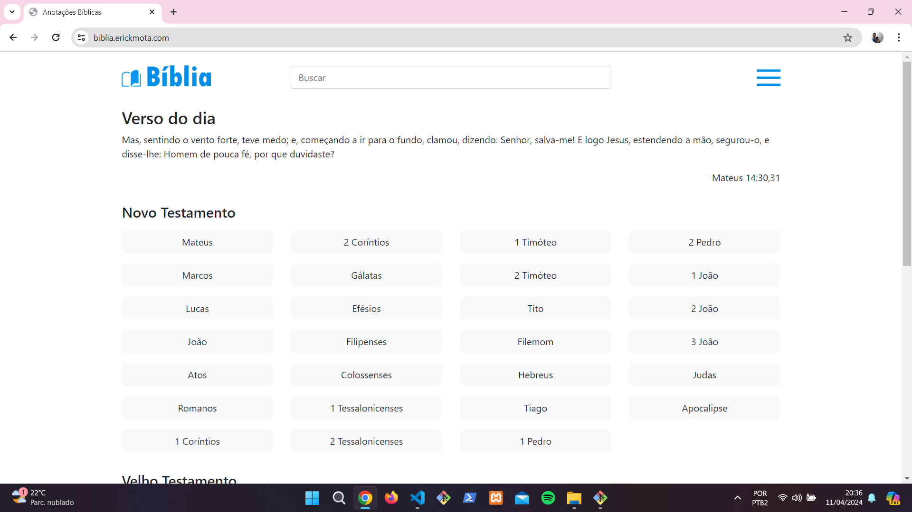
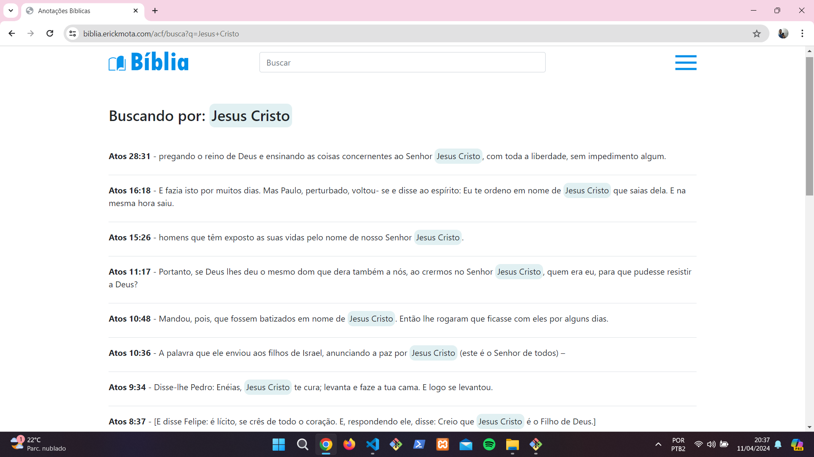
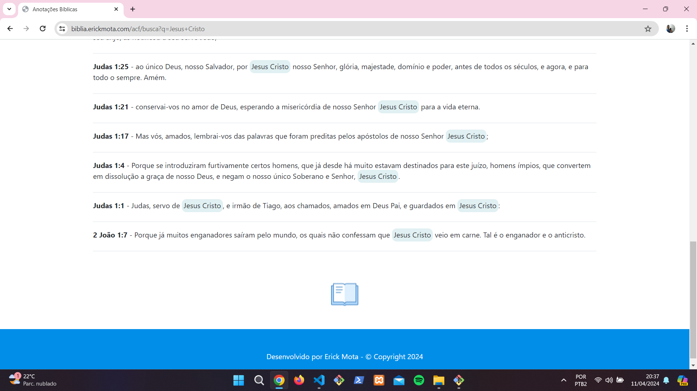
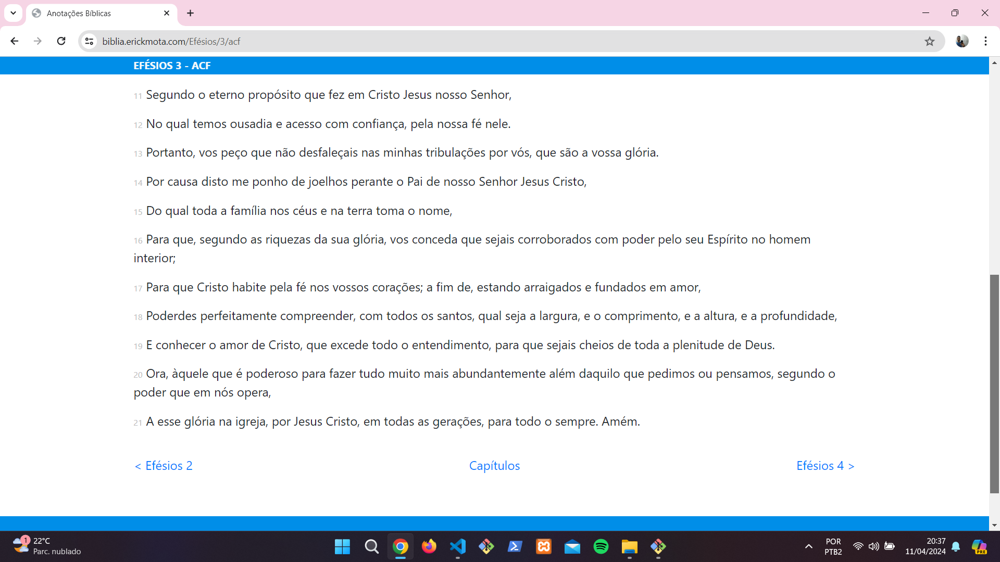

# Bíblia - 1.0.1

Bíblia, é um sistema web, para ajudar na leitura e estudo bíblico, nele é possível selecionar livros e capítulos para leitura, do novo e antigo testamento. Atualmente ele possui 3 versões para serem escolhidas pelo usuário, e tem um sistema para realizar a busca de versículos desejados.

## Funcionalidades e recursos

- Busca por passagens desejadas
- Seleção de versões
- Novo e velho testamento

## Funcionamento do sistema

A Bíblia inicia na tela para escolha entre novo e velho testamento, com todos os livros disponíveis. Após o usuário
selecionar o livro desejado, ele é encaminhado para a seleção de capítulos, quando ele escolhe um capítulo é direcionado para
a leitura do capítulo completo, onde ele pode escolher para a leitura 3 versões, que atualmente são:

- Almeida atualizada - AA
- Almeida corrigida e fiel - ACF
- Nova versão internacional - NVI

O usuário tem disponível também um campo de busca, onde ele pode fazer as buscas da passagem desejada. O sistema de busca foi criado com
o Ajax, então não tem sistema de paginação, tem apenas um botão, que ao o usuário clicar, irá carregar na mesma página mais resultados
da busca.

## Características

- Sistema PHP (sem framework)
- Banco de dados relacional - MySql
- Versão: 1.0.1